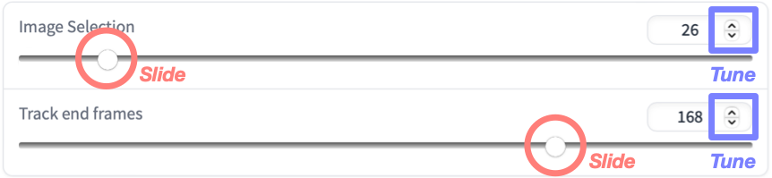

## Welcome to Track-Anything Tutorials

Here we illustrate how to use Track-Anything as an interactive tool to segment, track, and inpaint anything in videos. 

In the current version, Track-Anything works under a linear procedure of :one: [video selection](#step1), :two: [tracking preparation](#step2), :three: [tracking](#step3), and :four: [inpainting](#step4). 

### 1 Video Selection
When starting Track-Anything, the panel looks like:

**Recommended steps in this stage**:
**1-1**. Select one video from your local space or examples.
**1-2**. Click "***Get video info***" to unlock other controllers. 

### 2 Tracking Preparation
After video selection, all controllers are unlocked and the panel looks like:

**Recommended steps in this stage**:

**2-1**. Select ***Track End Frame*** (the last frame by default), via sliders (rough selection) and tunning buttons (precise selection).
**2-2**. Select ***Track Start Frame*** (***Image Selection***, the first frame by default) to add masks, via sliders (rough selection) and tunning buttons (precise selection).

- **Note**: Typing indices is also supported, but after typing, click somewhere on the panel (besides image and video part) to refresh the shown frame. 
- **Note**: Follow the order of 2-1, 2-2 to make sure the image shown is the start frame. 

**2-3**. Select one object/region on the ***Track Start Frame***, via adding positive / negative points:  

- **2-3-1**. Add one POSITIVE point on the target region. After this, one mask presents:

- **2-3-2**. If mask looks good, go to step 2-3-5. If not, go to step 2-3-3.

- **2-3-3**. If mask does not fully cover the target region, add one POSITIVE point on the lack part. In contrast, if mask covers the background, add one NEGATIVE point on the overcovered background. After adding pos/neg point, the mask is updated:

- **2-3-4**. If mask looks good, go to step 2-3-5. If not, go to step 2-3-3.

- **2-3-5**. Click "***Add Mask***".

- **Note**: If mask cannot be refined after many adds, click "***Clear Clicks***" to restart from step 2-3-1.  

- **Note**: After each "***Add Mask***", one item appears on the Dropdown List below, more operations about this controller is given in [Tracking](#step3):

- **Note**: Click "***Remove Mask***" to remove all masks from the list. 

**2-3**. If add another object/region, go to 2-2. If not, go to [Tracking](#step3). 

**Note**: ALL masks have to be added on the ***Track Start Frame*** only. 

### 3 Tracking

Track-Anything only tracks the objects shown in the Dropdown List. 

**Recommended steps in this stage**: 

**3-1**. Confirm the objects on the list. 

**3-2**. Click "***Tracking***".

After step 3-2, tracking is performed (for seconds or minutes, depending on video resolution and length), and results will be shown on the right video panel:

### 4 Inpainting

Track-Anything only "removes" the tracked objects from the input video. 

**Recommended steps in this stage**: 

**4-1**. Complete steps 3-1 and 3-2 to get tracking results. 

**4-2**. Select "***Resize Ratio***" to down-scale the video. 
- **Why down-scale?** Unlike tracking, inpainting cost much more GPU memory. Down-scale can effectively avoid Out-Of-Memory (OOM) error. The estimated GPU memory requirements are as below: 

|Resolution|50 frames|100 frames|1000 frames|
| :--- | :----: | :----: | :----: |
|1920 x 1080|OOM|OOM|OOM|
|1280 x 720|30GB|46GB|46GB|
|720 x 480|13GB|21GB|21GB|
|640 x 480|11GB|19GB|19GB|
|320 x 240|4GB|4.5GB|4.5GB|
|160 x 120|2.5GB|3GB|3GB|

**4-3**. Click "***Inpainting***". 

After step 4-3, inpainting is performed (for seconds or minutes, depending on video resolution and length), and results will be shown on the panel below:

