

## Welcome to Track-Anything Tutorials

Here we illustrate how to use Track-Anything as an interactive tool to segment, track, and inpaint anything in videos. 

In the current version, Track-Anything works under a linear procedure of :one: [video selection](#step1), :two: [tracking preparation](#step2), :three: [tracking](#step3), :four: [correction](#step4) (optional), and :five: [inpainting](#step5). 

---

### 1 Video Selection
When starting Track-Anything, the panel looks like:

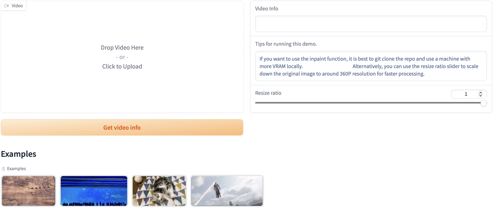

**Recommended steps in this stage**:

**1-1**. Select one video from your local computer or examples.

**1-2**. Click "***Get video info***" to unlock other controllers. 

---

### 2 Tracking Preparation
After "***Get video info***", all controllers are unlocked and the panel looks like:

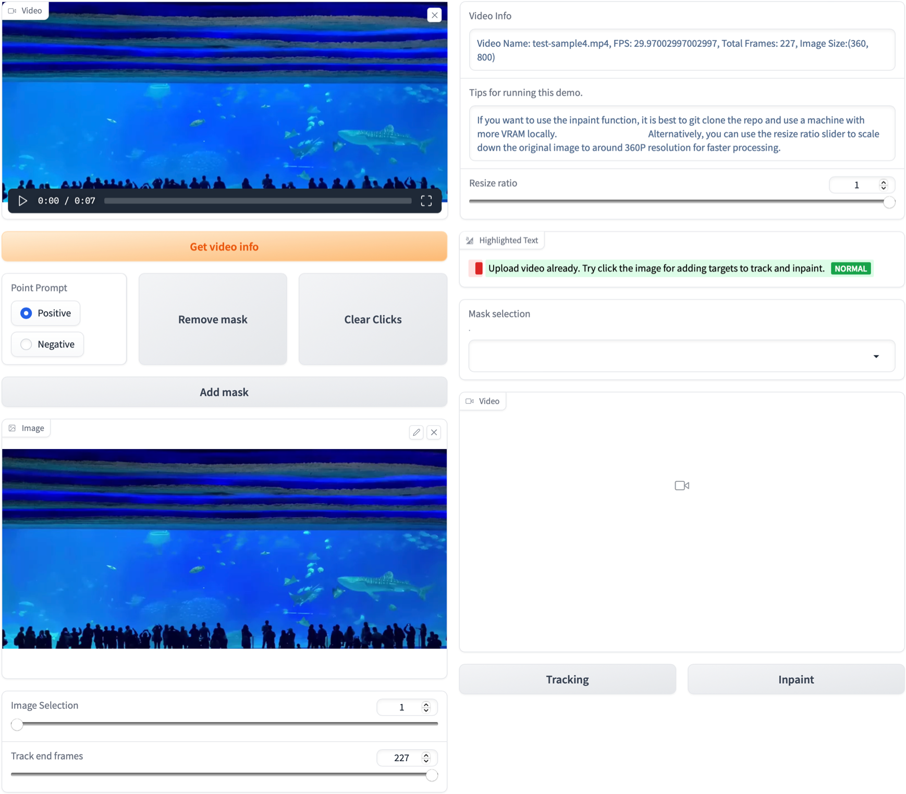

**Recommended steps in this stage**:

**2-1**. Select ***Track end frame*** (last frame by default).

**2-2**. Select ***Track start frame*** (first frame by default).
- **Note**: Follow the order of 2-1, 2-2 to make sure the image shown is the start frame. 

**2-3**. Add one mask on the ***Track start frame***, via clicking positive / negative points:  

- **2-3-1**. Click one POSITIVE point on the target region. After this, one mask presents:

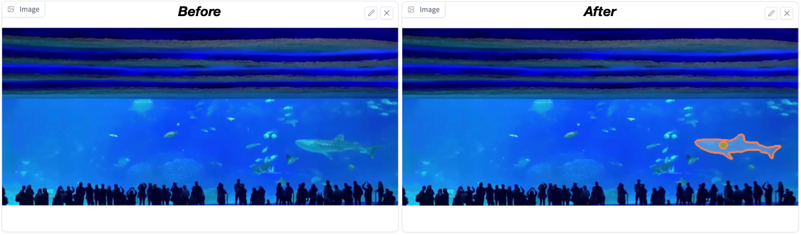

- **2-3-2**. If mask looks good, go to step 2-3-5. If not, go to step 2-3-3.

- **2-3-3**. If mask does not fully cover the target, click one POSITIVE point on the lack part. In contrast, if mask covers the background, click one NEGATIVE point on the overcovered region. After clicking POS/NEG point, the mask is updated: 

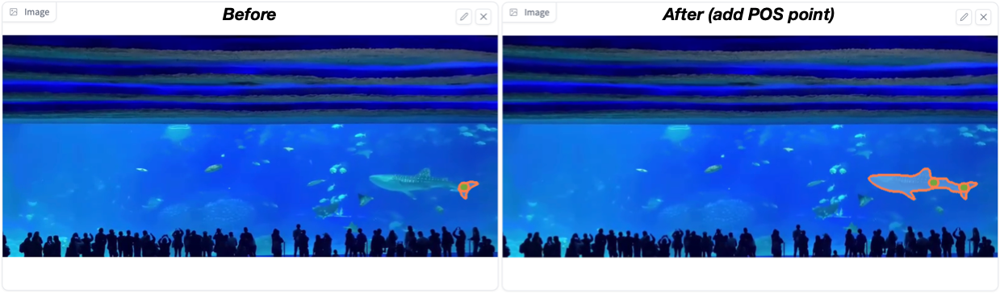

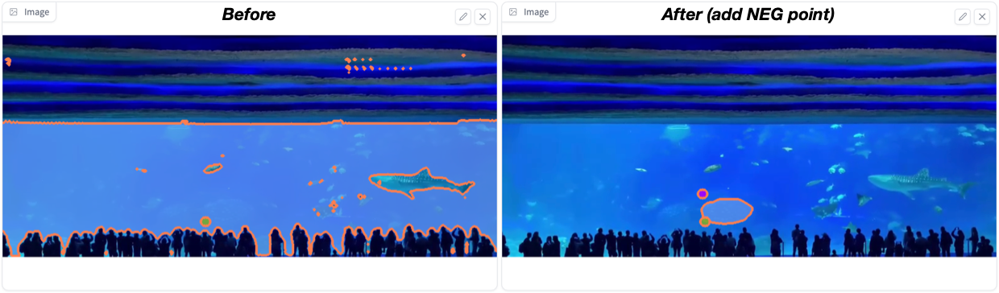

- **2-3-4**. If mask looks good, go to step 2-3-5. If not, go to step 2-3-3.

- **2-3-5**. Click "***Add mask***".

- **Note**: If mask cannot be refined after many clicks, click "***Clear clicks***" to restart from step 2-3-1.  

- **Note**: After each "***Add mask***", one item appears on the Dropdown List below: 

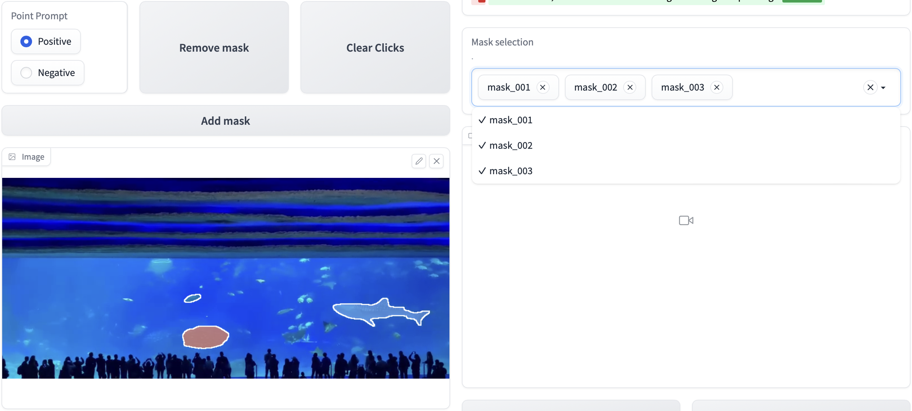

- **Note**: All masks can be removed by clicking "***Remove Mask***". 

**2-3**. If add another mask, go to 2-2. If not, go to [Tracking](#step3). 

**Note**: ALL masks have to be added on the ***Track start frame*** only. 

---

### 3 Tracking

Track-Anything only tracks object masks shown in the Dropdown List. 

**Recommended steps in this stage**: 

**3-1**. Confirm object masks on the list. 

**3-2**. Click "***Tracking***".

After step 3-2, tracking is performed (for seconds or minutes, depending on video resolution and length), and results will be shown on the right video panel:

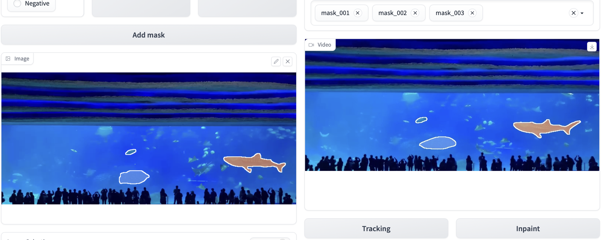

---

### 4 Correction

This stage is optional and recommended when tracking results degrade. (For example, degradation due to shot changes, occlusions):

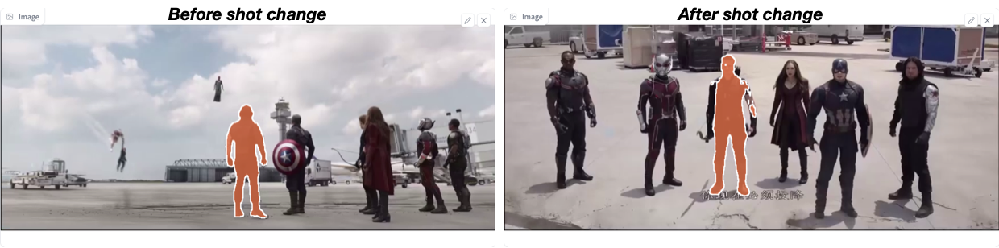

**Recommended steps in this stage**: 

**4-1**. Find the frame where degradation begins, and set the frame as "***Track start frame***". 

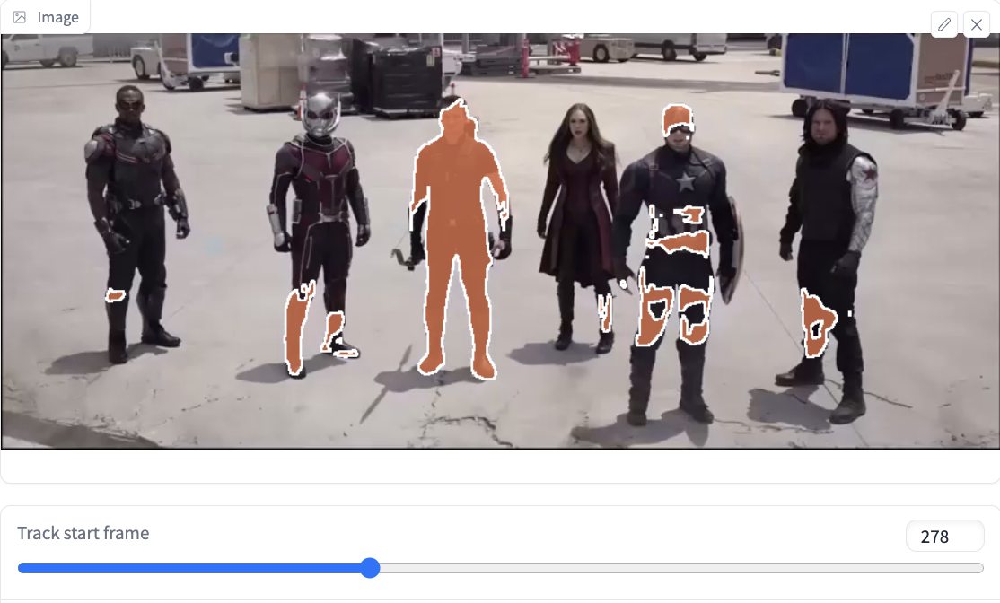

**4-2**. Click "***Remove mask***" to clear previous tracking results from "***Track start frame***".

**4-3**. Re-Add masks as in Step 2-3 on the "***Track start frame***".

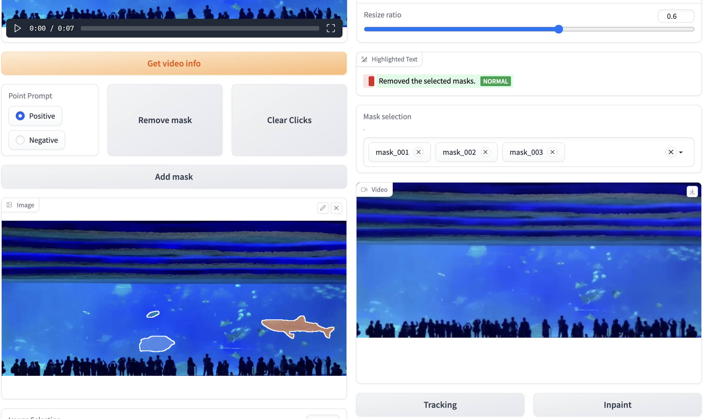

**4-4**. Click "***Tracking***".

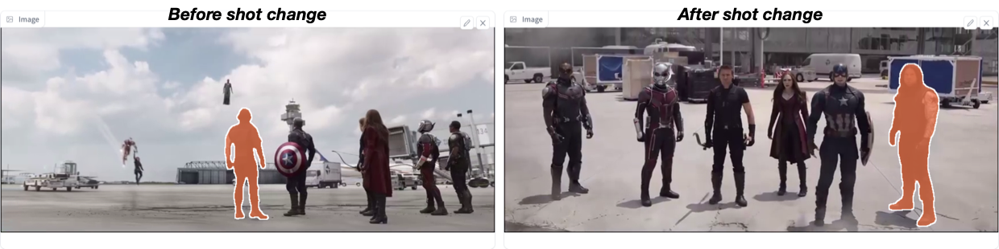

**Note**: Tracking between start and end frames provides a flexible method to address degradation. 

---

### 5 Inpainting

Track-Anything only "removes" the tracked objects from the input video. 

**Recommended steps in this stage**: 

**5-1**. Get tracking results. 

**5-2**. Select "***Resize Ratio***" to down-scale the video. 
- **Why down-scale?** Unlike tracking, inpainting cost much more GPU memory. Down-scale can effectively avoid Out-Of-Memory (OOM) error. The estimated GPU memory requirements are as below: 

|Resolution|50 frames|100 frames|1000 frames|
| :--- | :----: | :----: | :----: |
|1920 x 1080|OOM|OOM|OOM|
|1280 x 720|30GB|46GB|46GB|
|720 x 480|13GB|21GB|21GB|
|640 x 480|11GB|19GB|19GB|
|320 x 240|4GB|4.5GB|4.5GB|
|160 x 120|2.5GB|3GB|3GB|

**5-3**. Click "***Inpainting***". 

After step 5-3, inpainting is performed (for seconds or minutes, depending on video resolution and length), and results will be shown on the panel below:

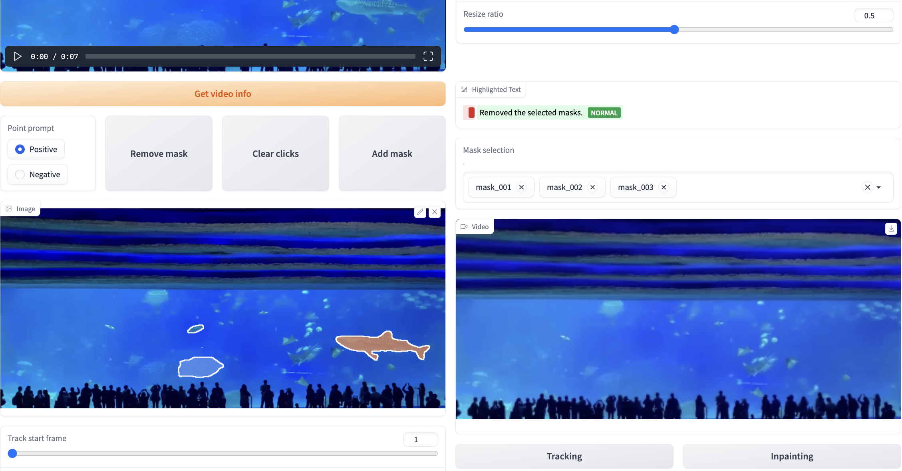

